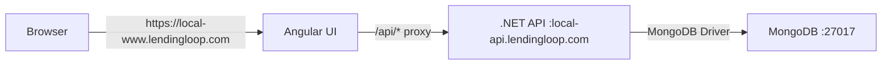

# Design Document

## Overview

This design describes a monorepo architecture containing an Angular frontend and a .NET 8 Web API backend, both configured for local development with MongoDB. The system implements a simple shared items management feature demonstrating full-stack CRUD operations.

The architecture follows a clean separation of concerns with the UI handling presentation logic, the API managing business logic and data access, and MongoDB providing persistent storage.

## Architecture

### High-Level Architecture



**Design Decision: Custom Local Domains with HTTPS**

The application uses custom local domain names (local-www.lendingloop.com and local-api.lendingloop.com) instead of localhost to:
- Simulate a production-like environment during development
- Avoid CORS complications with cookie handling and authentication
- Enable HTTPS with self-signed certificates for testing secure features
- Provide a consistent development experience across team members

This requires developers to configure their HOSTS file to map these domains to 127.0.0.1, which is documented in the README with a PowerShell script for easy setup.

### Monorepo Structure

```
/
├── .gitignore
├── README.md
├── ui/
│   ├── src/
│   │   ├── app/
│   │   │   ├── app.component.ts
│   │   │   ├── app.component.html
│   │   │   ├── app.component.css
│   │   │   ├── app.config.ts
│   │   │   └── services/
│   │   │       └── items.service.ts
│   │   ├── main.ts
│   │   └── index.html
│   ├── angular.json
│   ├── package.json
│   └── tsconfig.json
└── api/
    ├── Program.cs
    ├── appsettings.json
    ├── appsettings.Development.json
    ├── Api.csproj
    ├── Models/
    │   └── SharedItem.cs
    ├── Services/
    │   ├── IItemsService.cs
    │   └── ItemsService.cs
    └── Controllers/
        └── ItemsController.cs
```

## Components and Interfaces

### Frontend Components

#### Angular UI (https://local-www.lendingloop.com)

**HTTPS Configuration**
- The Angular development server is configured to use HTTPS with a self-signed certificate
- Runs on custom domain local-www.lendingloop.com (requires HOSTS file configuration)
- Self-signed certificate allows testing of secure features during development
- Browser will show security warnings that developers must accept

**Styling Approach**
- Use Angular Material components for UI elements (buttons, forms, cards, lists, etc.)
- Minimize custom CSS in favor of Material Design components and theming
- Apply custom styles only when Material components don't provide the needed functionality
- Leverage Material's built-in responsive design and accessibility features

**AppComponent**
- Responsibility: Main application component that displays items and handles user interactions
- Key Methods:
  - `ngOnInit()`: Fetches items on component initialization
  - `loadItems()`: Retrieves all items from the API
  - `addItem(name: string, imageFile?: File)`: Creates a new item and optionally uploads an image, then refreshes the list
  - `onFileSelected(event: Event)`: Handles file input change events for image selection

**ItemsService**
- Responsibility: HTTP client service for API communication
- Configuration: Uses full API URL (https://local-api.lendingloop.com) for all requests
- Key Methods:
  - `getItems(): Observable<SharedItem[]>`: GET request to https://local-api.lendingloop.com/api/items
  - `createItem(item: Partial<SharedItem>): Observable<SharedItem>`: POST request to https://local-api.lendingloop.com/api/items
  - `uploadItemImage(itemId: string, imageFile: File): Observable<SharedItem>`: POST request to https://local-api.lendingloop.com/api/items/{id}/image with multipart form data

**Design Decision: Direct API Requests Without Proxy**

The Angular UI makes direct HTTP requests to the full API domain (https://local-api.lendingloop.com) instead of using a proxy configuration. This approach:
- Provides a more production-like environment where frontend and backend are on separate domains
- Simplifies the development setup by eliminating proxy configuration
- Requires proper CORS configuration on the API to allow cross-origin requests from https://local-www.lendingloop.com
- Tests the actual CORS behavior that will be used in production
- Allows the API to be accessed independently for testing and debugging

### Backend Components

#### .NET API (https://local-api.lendingloop.com)

**HTTPS Configuration**
- The API is configured to use HTTPS with a self-signed certificate
- Runs on custom domain local-api.lendingloop.com (requires HOSTS file configuration)
- Kestrel web server is configured to listen on HTTPS with the self-signed certificate
- Certificate configuration is specified in appsettings.Development.json or launchSettings.json

**ItemsController**
- Responsibility: REST API controller exposing item endpoints
- Endpoints:
  - `GET /api/items`: Returns all items
  - `POST /api/items`: Creates a new item
  - `POST /api/items/{id}/image`: Uploads an image for a specific item
- Dependencies: IItemsService, IWebHostEnvironment (for file storage)

**ItemsService**
- Responsibility: Business logic and data access for items
- Key Methods:
  - `Task<List<SharedItem>> GetAllItemsAsync()`: Retrieves all items from MongoDB
  - `Task<SharedItem> CreateItemAsync(SharedItem item)`: Inserts a new item into MongoDB
  - `Task<SharedItem?> UpdateItemImageAsync(string id, string imageUrl)`: Updates the ImageUrl property for a specific item
- Dependencies: IMongoCollection<SharedItem>

**Program.cs Configuration**
- MongoDB client registration
- CORS policy configuration (allow https://local-www.lendingloop.com)
- HTTPS configuration with Kestrel for custom domain
- Service registration
- Controller mapping
- Static file serving for uploaded images

## Data Models

### SharedItem Model

**C# Class (SharedItem.cs)**
```csharp
using MongoDB.Bson;
using MongoDB.Bson.Serialization.Attributes;

public class SharedItem
{
    [BsonId]
    [BsonRepresentationAttribute(BsonType.ObjectId)]
    public string? Id { get; set; }
    
    [BsonElement("name")]
    public string Name { get; set; } = string.Empty;
    
    [BsonElement("ownerId")]
    public string OwnerId { get; set; } = string.Empty;
    
    [BsonElement("isAvailable")]
    public bool IsAvailable { get; set; } = true;
    
    [BsonElement("imageUrl")]
    public string? ImageUrl { get; set; }
}
```

**TypeScript Interface (Angular)**
```typescript
export interface SharedItem {
  id?: string;
  name: string;
  ownerId: string;
  isAvailable: boolean;
  imageUrl?: string;
}
```

### MongoDB Configuration

- Database Name: `SharedItemsDb`
- Collection Name: `items`
- Connection String: `mongodb://localhost:27017`

## Configuration Details

### Local Development Environment Setup

**HOSTS File Configuration**

The application requires custom domain names to be mapped to localhost in the system HOSTS file:
- Windows: `C:\Windows\System32\drivers\etc\hosts`
- Mac/Linux: `/etc/hosts`

Required entries:
```
127.0.0.1 local-www.lendingloop.com
127.0.0.1 local-api.lendingloop.com
```

**PowerShell Script for HOSTS Configuration**

A PowerShell script should be provided in the repository root to automate HOSTS file configuration:

```powershell
# add-hosts.ps1
# Run as Administrator

$hostsPath = "C:\Windows\System32\drivers\etc\hosts"
$entries = @(
    "127.0.0.1 local-www.lendingloop.com",
    "127.0.0.1 local-api.lendingloop.com"
)

foreach ($entry in $entries) {
    $exists = Get-Content $hostsPath | Select-String -Pattern $entry
    if (-not $exists) {
        Add-Content -Path $hostsPath -Value $entry
        Write-Host "Added: $entry"
    } else {
        Write-Host "Already exists: $entry"
    }
}

Write-Host "HOSTS file configuration complete!"
```

**Design Decision: Automated HOSTS Configuration**

Providing a PowerShell script reduces friction for new developers by automating the HOSTS file setup. The script is idempotent (can be run multiple times safely) and provides clear feedback about what was added.

**Self-Signed Certificate Generation**

Developers need to generate self-signed certificates for local HTTPS. The README should provide instructions using OpenSSL or PowerShell:

**Option 1: Using OpenSSL (cross-platform)**
```bash
# Generate certificate and key for Angular
openssl req -x509 -newkey rsa:4096 -keyout key.pem -out cert.pem -days 365 -nodes

# Generate .pfx for .NET API
openssl pkcs12 -export -out cert.pfx -inkey key.pem -in cert.pem
```

**Option 2: Using PowerShell (Windows)**
```powershell
# Generate self-signed certificate
$cert = New-SelfSignedCertificate -DnsName "local-www.lendingloop.com", "local-api.lendingloop.com" -CertStoreLocation "cert:\LocalMachine\My"

# Export for use
$pwd = ConvertTo-SecureString -String "YourPassword" -Force -AsPlainText
Export-PfxCertificate -Cert $cert -FilePath "cert.pfx" -Password $pwd
```

**Design Decision: Certificate Generation Options**

Providing multiple certificate generation options (OpenSSL and PowerShell) ensures developers can use their preferred tools and works across different operating systems.

### Angular Configuration

**angular.json modifications**
- Add HTTPS settings to serve options:
```json
"serve": {
  "options": {
    "ssl": true,
    "sslCert": "path/to/cert.pem",
    "sslKey": "path/to/key.pem",
    "host": "local-www.lendingloop.com"
  }
}
```

**Design Decision: Self-Signed Certificate Generation**

Self-signed certificates for local development can be generated using OpenSSL or other tools. The certificate files (cert.pem and key.pem) should be stored in a secure location and referenced in angular.json. These certificates are for development only and should never be committed to version control.

**Design Decision: No Proxy Configuration**

Unlike typical Angular development setups that use a proxy to forward API requests, this application makes direct requests to the API domain (https://local-api.lendingloop.com). This design choice:
- Mirrors production architecture where frontend and backend are on separate domains
- Requires explicit CORS configuration on the backend
- Allows independent testing of frontend and backend
- Eliminates proxy-related configuration and potential issues
- Provides a more realistic development environment

**package.json dependencies**
- @angular/core, @angular/common, @angular/platform-browser
- @angular/common/http (for HttpClient)
- @angular/material (for Material Design components)
- @angular/cdk (peer dependency for Material)
- rxjs (for observables)

### .NET API Configuration

**appsettings.Development.json**
```json
{
  "MongoDB": {
    "ConnectionString": "mongodb://localhost:27017",
    "DatabaseName": "SharedItemsDb",
    "CollectionName": "items"
  },
  "FileStorage": {
    "UploadPath": "uploads/images",
    "MaxFileSizeBytes": 5242880
  },
  "Kestrel": {
    "Endpoints": {
      "Https": {
        "Url": "https://local-api.lendingloop.com:443",
        "Certificate": {
          "Path": "path/to/cert.pfx",
          "Password": "certificate-password"
        }
      }
    }
  },
  "Logging": {
    "LogLevel": {
      "Default": "Information"
    }
  }
}
```

**Design Decision: Kestrel HTTPS Configuration**

The Kestrel web server is configured to use HTTPS with a self-signed certificate in .pfx format. The certificate path and password are specified in appsettings.Development.json. For production, these settings would be replaced with proper SSL certificates from a trusted certificate authority.

**CORS Policy**
- Policy Name: "AllowAngularDev"
- Allowed Origin: https://local-www.lendingloop.com
- Allowed Methods: GET, POST, PUT, DELETE, OPTIONS
- Allowed Headers: Content-Type, Accept
- Allow Credentials: true (for cookie-based authentication in future features)

**Design Decision: CORS with Credentials**

The CORS policy is configured to allow credentials (cookies, authorization headers) to support future authentication features. This requires specifying an explicit origin rather than using a wildcard.

**NuGet Packages**
- MongoDB.Driver (latest stable)
- Microsoft.AspNetCore.OpenApi (for API documentation)

## Error Handling

### Frontend Error Handling

**HTTP Errors**
- Display user-friendly error messages in the UI
- Log errors to console for debugging
- Handle network failures gracefully

**Implementation Approach**
- Use RxJS catchError operator in service methods
- Display error messages in the component template

### Backend Error Handling

**API Error Responses**
- Return appropriate HTTP status codes:
  - 200 OK: Successful GET
  - 201 Created: Successful POST
  - 400 Bad Request: Invalid input
  - 500 Internal Server Error: Server-side errors

**MongoDB Connection Errors**
- Log connection failures
- Return 500 status code if database is unavailable

**Validation**
- Validate required fields (Name cannot be empty)
- Validate image file types (accept only common image formats: jpg, jpeg, png, gif)
- Validate image file size (maximum 5MB)
- Return 400 Bad Request for invalid data

## Testing Strategy

### Manual Testing Approach

**Prerequisites Verification**
1. Verify MongoDB is running on localhost:27017
2. Verify .NET 8 SDK is installed
3. Verify Node.js and Angular CLI are installed
4. Configure HOSTS file using provided PowerShell script
5. Generate self-signed certificates for HTTPS
6. Configure certificate paths in angular.json and appsettings.Development.json

**API Testing**
1. Start the API with `dotnet run` from the api directory
2. Verify API responds on https://local-api.lendingloop.com
3. Accept browser security warning for self-signed certificate
4. Test GET /api/items endpoint (should return empty array initially)
5. Test POST /api/items endpoint with sample data
6. Verify data persists in MongoDB

**UI Testing**
1. Start the UI with `ng serve` from the ui directory
2. Navigate to https://local-www.lendingloop.com
3. Accept browser security warning for self-signed certificate
4. Verify empty list displays initially
5. Add a new item using the form
6. Verify item appears in the list
7. Verify item persists after page refresh

**Integration Testing**
1. Start both API and UI
2. Verify Angular UI makes direct requests to https://local-api.lendingloop.com
3. Verify CORS headers allow cross-origin requests from https://local-www.lendingloop.com
4. Test complete flow: add item → see in list → refresh → still visible
5. Test image upload: add item with image → verify image displays → refresh → image still visible

### Development Workflow

**Prerequisites Setup**
1. Configure HOSTS file to map custom domains to 127.0.0.1:
   - local-www.lendingloop.com → 127.0.0.1
   - local-api.lendingloop.com → 127.0.0.1
   - Use provided PowerShell script for automated setup (see README)
2. Generate self-signed certificates for HTTPS (instructions in README)
3. Configure certificate paths in angular.json and appsettings.Development.json

**Daily Development**
1. Start MongoDB service
2. Start API in one terminal: `cd api && dotnet run`
3. Start UI in another terminal: `cd ui && ng serve`
4. Open browser to https://local-www.lendingloop.com
5. Accept browser security warnings for self-signed certificates
6. Make changes and verify hot-reload works for both UI and API

**Design Decision: HOSTS File Configuration**

Using custom local domains requires HOSTS file configuration, which adds a one-time setup step for developers. This trade-off is acceptable because:
- It provides a more production-like environment
- It simplifies CORS and cookie handling
- It's a one-time setup per machine
- The PowerShell script automates the process

## Security Considerations

**Development Environment**
- CORS is configured for specific origin (https://local-www.lendingloop.com) only
- Self-signed certificates are used for HTTPS (browsers will show warnings)
- Certificate files should not be committed to version control
- No authentication/authorization in MVP
- MongoDB connection has no authentication (local development only)
- Direct API requests require proper CORS configuration on the backend

**Design Decision: Self-Signed Certificates in Development**

Using self-signed certificates in development allows testing of HTTPS features without the cost and complexity of obtaining real certificates. The security warnings are acceptable in development because:
- Developers understand the implications
- It's a controlled local environment
- It enables testing of secure features early
- Production will use proper certificates from a trusted CA

**Certificate Management**
- Certificates should be generated per developer machine
- Certificate files should be added to .gitignore
- Certificate passwords should not be hardcoded (use environment variables or user secrets)
- Provide clear documentation for certificate generation in README

**Future Enhancements** (out of scope for MVP)
- Add authentication and authorization
- Implement user management
- Secure MongoDB with authentication
- Add input sanitization and validation
- Implement rate limiting
- Use proper SSL certificates in production
