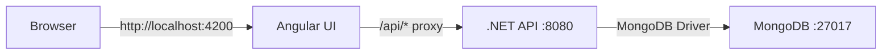

# Design Document

## Overview

This design describes a monorepo architecture containing an Angular frontend and a .NET 8 Web API backend, both configured for local development with MongoDB. The system implements a simple shared items management feature demonstrating full-stack CRUD operations.

The architecture follows a clean separation of concerns with the UI handling presentation logic, the API managing business logic and data access, and MongoDB providing persistent storage.

## Architecture

### High-Level Architecture



### Monorepo Structure

```
/
├── .gitignore
├── README.md
├── ui/
│   ├── src/
│   │   ├── app/
│   │   │   ├── app.component.ts
│   │   │   ├── app.component.html
│   │   │   ├── app.component.css
│   │   │   ├── app.config.ts
│   │   │   └── services/
│   │   │       └── items.service.ts
│   │   ├── main.ts
│   │   └── index.html
│   ├── angular.json
│   ├── package.json
│   ├── tsconfig.json
│   └── proxy.conf.json
└── api/
    ├── Program.cs
    ├── appsettings.json
    ├── appsettings.Development.json
    ├── Api.csproj
    ├── Models/
    │   └── SharedItem.cs
    ├── Services/
    │   ├── IItemsService.cs
    │   └── ItemsService.cs
    └── Controllers/
        └── ItemsController.cs
```

## Components and Interfaces

### Frontend Components

#### Angular UI (Port 4200)

**Styling Approach**
- Use Angular Material components for UI elements (buttons, forms, cards, lists, etc.)
- Minimize custom CSS in favor of Material Design components and theming
- Apply custom styles only when Material components don't provide the needed functionality
- Leverage Material's built-in responsive design and accessibility features

**AppComponent**
- Responsibility: Main application component that displays items and handles user interactions
- Key Methods:
  - `ngOnInit()`: Fetches items on component initialization
  - `loadItems()`: Retrieves all items from the API
  - `addItem(name: string, imageFile?: File)`: Creates a new item and optionally uploads an image, then refreshes the list
  - `onFileSelected(event: Event)`: Handles file input change events for image selection

**ItemsService**
- Responsibility: HTTP client service for API communication
- Key Methods:
  - `getItems(): Observable<SharedItem[]>`: GET request to /api/items
  - `createItem(item: Partial<SharedItem>): Observable<SharedItem>`: POST request to /api/items
  - `uploadItemImage(itemId: string, imageFile: File): Observable<SharedItem>`: POST request to /api/items/{id}/image with multipart form data

**Proxy Configuration (proxy.conf.json)**
```json
{
  "/api": {
    "target": "http://localhost:8080",
    "secure": false,
    "changeOrigin": true
  }
}
```

### Backend Components

#### .NET API (Port 8080)

**ItemsController**
- Responsibility: REST API controller exposing item endpoints
- Endpoints:
  - `GET /api/items`: Returns all items
  - `POST /api/items`: Creates a new item
  - `POST /api/items/{id}/image`: Uploads an image for a specific item
- Dependencies: IItemsService, IWebHostEnvironment (for file storage)

**ItemsService**
- Responsibility: Business logic and data access for items
- Key Methods:
  - `Task<List<SharedItem>> GetAllItemsAsync()`: Retrieves all items from MongoDB
  - `Task<SharedItem> CreateItemAsync(SharedItem item)`: Inserts a new item into MongoDB
  - `Task<SharedItem?> UpdateItemImageAsync(string id, string imageUrl)`: Updates the ImageUrl property for a specific item
- Dependencies: IMongoCollection<SharedItem>

**Program.cs Configuration**
- MongoDB client registration
- CORS policy configuration (allow http://localhost:4200)
- Service registration
- Controller mapping

## Data Models

### SharedItem Model

**C# Class (SharedItem.cs)**
```csharp
using MongoDB.Bson;
using MongoDB.Bson.Serialization.Attributes;

public class SharedItem
{
    [BsonId]
    [BsonRepresentationAttribute(BsonType.ObjectId)]
    public string? Id { get; set; }
    
    [BsonElement("name")]
    public string Name { get; set; } = string.Empty;
    
    [BsonElement("ownerId")]
    public string OwnerId { get; set; } = string.Empty;
    
    [BsonElement("isAvailable")]
    public bool IsAvailable { get; set; } = true;
    
    [BsonElement("imageUrl")]
    public string? ImageUrl { get; set; }
}
```

**TypeScript Interface (Angular)**
```typescript
export interface SharedItem {
  id?: string;
  name: string;
  ownerId: string;
  isAvailable: boolean;
  imageUrl?: string;
}
```

### MongoDB Configuration

- Database Name: `SharedItemsDb`
- Collection Name: `items`
- Connection String: `mongodb://localhost:27017`

## Configuration Details

### Angular Configuration

**angular.json modifications**
- Add proxy configuration to serve options:
```json
"serve": {
  "options": {
    "proxyConfig": "proxy.conf.json"
  }
}
```

**package.json dependencies**
- @angular/core, @angular/common, @angular/platform-browser
- @angular/common/http (for HttpClient)
- @angular/material (for Material Design components)
- @angular/cdk (peer dependency for Material)
- rxjs (for observables)

### .NET API Configuration

**appsettings.Development.json**
```json
{
  "MongoDB": {
    "ConnectionString": "mongodb://localhost:27017",
    "DatabaseName": "SharedItemsDb",
    "CollectionName": "items"
  },
  "FileStorage": {
    "UploadPath": "uploads/images",
    "MaxFileSizeBytes": 5242880
  },
  "Logging": {
    "LogLevel": {
      "Default": "Information"
    }
  }
}
```

**CORS Policy**
- Policy Name: "AllowAngularDev"
- Allowed Origin: http://localhost:4200
- Allowed Methods: GET, POST, PUT, DELETE, OPTIONS
- Allowed Headers: Content-Type, Accept

**NuGet Packages**
- MongoDB.Driver (latest stable)
- Microsoft.AspNetCore.OpenApi (for API documentation)

## Error Handling

### Frontend Error Handling

**HTTP Errors**
- Display user-friendly error messages in the UI
- Log errors to console for debugging
- Handle network failures gracefully

**Implementation Approach**
- Use RxJS catchError operator in service methods
- Display error messages in the component template

### Backend Error Handling

**API Error Responses**
- Return appropriate HTTP status codes:
  - 200 OK: Successful GET
  - 201 Created: Successful POST
  - 400 Bad Request: Invalid input
  - 500 Internal Server Error: Server-side errors

**MongoDB Connection Errors**
- Log connection failures
- Return 500 status code if database is unavailable

**Validation**
- Validate required fields (Name cannot be empty)
- Validate image file types (accept only common image formats: jpg, jpeg, png, gif)
- Validate image file size (maximum 5MB)
- Return 400 Bad Request for invalid data

## Testing Strategy

### Manual Testing Approach

**Prerequisites Verification**
1. Verify MongoDB is running on localhost:27017
2. Verify .NET 8 SDK is installed
3. Verify Node.js and Angular CLI are installed

**API Testing**
1. Start the API with `dotnet run`
2. Verify API responds on http://localhost:8080
3. Test GET /api/items endpoint (should return empty array initially)
4. Test POST /api/items endpoint with sample data
5. Verify data persists in MongoDB

**UI Testing**
1. Start the UI with `ng serve`
2. Navigate to http://localhost:4200
3. Verify empty list displays initially
4. Add a new item using the form
5. Verify item appears in the list
6. Verify item persists after page refresh

**Integration Testing**
1. Start both API and UI
2. Verify proxy forwards requests correctly
3. Test complete flow: add item → see in list → refresh → still visible

### Development Workflow

1. Start MongoDB service
2. Start API in one terminal: `cd api && dotnet run`
3. Start UI in another terminal: `cd ui && ng serve`
4. Open browser to http://localhost:4200
5. Make changes and verify hot-reload works for both UI and API

## Security Considerations

**Development Environment**
- CORS is permissive for local development only
- No authentication/authorization in MVP
- MongoDB connection has no authentication (local development only)

**Future Enhancements** (out of scope for MVP)
- Add authentication and authorization
- Implement user management
- Secure MongoDB with authentication
- Add input sanitization and validation
- Implement rate limiting
