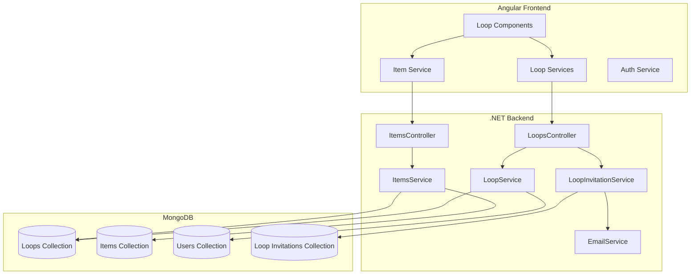
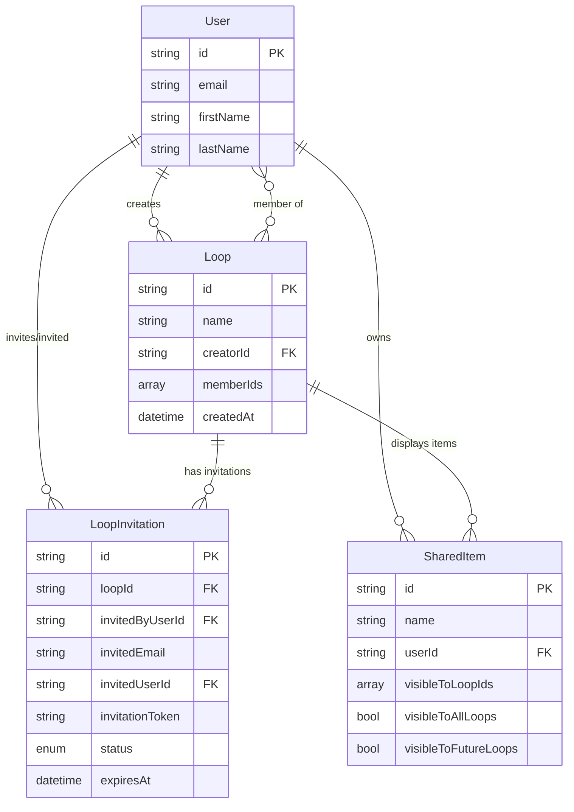

# Design Document: Custom Loops

## Overview

The Custom Loops feature extends the existing shared items application to support group-based sharing through "loops". This design integrates with the existing MongoDB-based .NET 8 backend and Angular frontend, following established patterns for authentication, data models, and services.

The system enables users to create loops, invite members via email or from existing loops, control item visibility per loop, and browse/search items within each loop. The design emphasizes scalability, security, and user experience while maintaining consistency with the existing codebase architecture.

## Architecture

### High-Level Architecture



### Technology Stack

- **Backend**: .NET 8 Web API, MongoDB.Driver
- **Frontend**: Angular 18+, RxJS
- **Database**: MongoDB
- **Authentication**: JWT (existing implementation)
- **Email**: SMTP (existing EmailService)

## Components and Interfaces

### Backend Models

#### Loop Model
```csharp
public class Loop
{
    [BsonId]
    [BsonRepresentation(BsonType.ObjectId)]
    public string? Id { get; set; }
    
    [BsonElement("name")]
    public string Name { get; set; } = string.Empty;
    
    [BsonElement("creatorId")]
    public string CreatorId { get; set; } = string.Empty;
    
    [BsonElement("memberIds")]
    public List<string> MemberIds { get; set; } = new();
    
    [BsonElement("createdAt")]
    public DateTime CreatedAt { get; set; } = DateTime.UtcNow;
    
    [BsonElement("updatedAt")]
    public DateTime UpdatedAt { get; set; } = DateTime.UtcNow;
}
```

#### LoopInvitation Model
```csharp
public class LoopInvitation
{
    [BsonId]
    [BsonRepresentation(BsonType.ObjectId)]
    public string? Id { get; set; }
    
    [BsonElement("loopId")]
    public string LoopId { get; set; } = string.Empty;
    
    [BsonElement("invitedByUserId")]
    public string InvitedByUserId { get; set; } = string.Empty;
    
    [BsonElement("invitedEmail")]
    public string InvitedEmail { get; set; } = string.Empty;
    
    [BsonElement("invitedUserId")]
    public string? InvitedUserId { get; set; }
    
    [BsonElement("invitationToken")]
    public string InvitationToken { get; set; } = string.Empty;
    
    [BsonElement("status")]
    public InvitationStatus Status { get; set; } = InvitationStatus.Pending;
    
    [BsonElement("expiresAt")]
    public DateTime ExpiresAt { get; set; }
    
    [BsonElement("createdAt")]
    public DateTime CreatedAt { get; set; } = DateTime.UtcNow;
    
    [BsonElement("acceptedAt")]
    public DateTime? AcceptedAt { get; set; }
}

public enum InvitationStatus
{
    Pending,
    Accepted,
    Expired,
    Declined
}
```

#### Updated SharedItem Model
```csharp
public class SharedItem
{
    [BsonId]
    [BsonRepresentation(BsonType.ObjectId)]
    public string? Id { get; set; }
    
    [BsonElement("name")]
    public string Name { get; set; } = string.Empty;
    
    [BsonElement("description")]
    public string Description { get; set; } = string.Empty;
    
    [BsonElement("userId")]
    public string UserId { get; set; } = string.Empty;
    
    [BsonElement("isAvailable")]
    public bool IsAvailable { get; set; } = true;
    
    [BsonElement("imageUrl")]
    public string? ImageUrl { get; set; }
    
    [BsonElement("visibleToLoopIds")]
    public List<string> VisibleToLoopIds { get; set; } = new();
    
    [BsonElement("visibleToAllLoops")]
    public bool VisibleToAllLoops { get; set; } = false;
    
    [BsonElement("visibleToFutureLoops")]
    public bool VisibleToFutureLoops { get; set; } = false;
    
    [BsonElement("createdAt")]
    public DateTime CreatedAt { get; set; } = DateTime.UtcNow;
    
    [BsonElement("updatedAt")]
    public DateTime UpdatedAt { get; set; } = DateTime.UtcNow;
}
```

### Backend Services

#### ILoopService Interface
```csharp
public interface ILoopService
{
    Task<Loop> CreateLoopAsync(string name, string creatorId);
    Task<Loop?> GetLoopByIdAsync(string loopId);
    Task<List<Loop>> GetUserLoopsAsync(string userId);
    Task<List<User>> GetLoopMembersAsync(string loopId);
    Task<bool> IsUserLoopMemberAsync(string loopId, string userId);
    Task<Loop?> AddMemberToLoopAsync(string loopId, string userId);
    Task<Loop?> RemoveMemberFromLoopAsync(string loopId, string userId);
    Task<List<User>> GetPotentialInviteesFromOtherLoopsAsync(string userId, string currentLoopId);
}
```

#### ILoopInvitationService Interface
```csharp
public interface ILoopInvitationService
{
    Task<LoopInvitation> CreateEmailInvitationAsync(string loopId, string invitedByUserId, string email);
    Task<LoopInvitation> CreateUserInvitationAsync(string loopId, string invitedByUserId, string invitedUserId);
    Task<LoopInvitation?> AcceptInvitationAsync(string token);
    Task<LoopInvitation?> AcceptInvitationByUserAsync(string invitationId, string userId);
    Task<List<LoopInvitation>> GetPendingInvitationsForUserAsync(string userId);
    Task<List<LoopInvitation>> GetPendingInvitationsForLoopAsync(string loopId);
    Task ExpireOldInvitationsAsync();
}
```

#### Updated IItemsService Interface
```csharp
public interface IItemsService
{
    // Existing methods
    Task<List<SharedItem>> GetAllItemsAsync();
    Task<List<SharedItem>> GetItemsByUserIdAsync(string userId);
    Task<SharedItem> CreateItemAsync(SharedItem item);
    Task<SharedItem?> UpdateItemImageAsync(string id, string imageUrl, string userId);
    
    // New methods for loops
    Task<List<SharedItem>> GetItemsByLoopIdAsync(string loopId);
    Task<SharedItem?> UpdateItemVisibilityAsync(string itemId, string userId, List<string> loopIds, bool visibleToAllLoops, bool visibleToFutureLoops);
    Task<SharedItem?> GetItemByIdAsync(string itemId);
}
```

### Backend Controllers

#### LoopsController Endpoints
- `POST /api/loops` - Create a new loop
- `GET /api/loops` - Get all loops for authenticated user
- `GET /api/loops/{id}` - Get loop details
- `GET /api/loops/{id}/members` - Get loop members
- `GET /api/loops/{id}/items` - Get items visible in loop
- `POST /api/loops/{id}/invite-email` - Invite user by email
- `POST /api/loops/{id}/invite-user` - Invite existing user
- `GET /api/loops/{id}/potential-invitees` - Get users from other loops
- `POST /api/loops/invitations/{token}/accept` - Accept invitation via email link
- `POST /api/loops/invitations/{id}/accept-user` - Accept invitation for logged-in user
- `GET /api/loops/invitations/pending` - Get pending invitations for user

#### Updated ItemsController Endpoints
- `PUT /api/items/{id}/visibility` - Update item loop visibility settings

### Frontend Models

#### TypeScript Interfaces
```typescript
export interface Loop {
  id?: string;
  name: string;
  creatorId: string;
  memberIds: string[];
  createdAt: Date;
  updatedAt: Date;
  memberCount?: number;
  itemCount?: number;
}

export interface LoopInvitation {
  id?: string;
  loopId: string;
  loopName?: string;
  invitedByUserId: string;
  invitedByUserName?: string;
  invitedEmail: string;
  invitedUserId?: string;
  invitationToken: string;
  status: 'Pending' | 'Accepted' | 'Expired' | 'Declined';
  expiresAt: Date;
  createdAt: Date;
  acceptedAt?: Date;
}

export interface SharedItem {
  id?: string;
  name: string;
  description: string;
  userId: string;
  isAvailable: boolean;
  imageUrl?: string;
  visibleToLoopIds: string[];
  visibleToAllLoops: boolean;
  visibleToFutureLoops: boolean;
  createdAt: Date;
  updatedAt: Date;
  ownerName?: string;
}

export interface LoopMember {
  id: string;
  email: string;
  firstName: string;
  lastName: string;
}
```

### Frontend Services

#### LoopService
```typescript
@Injectable({ providedIn: 'root' })
export class LoopService {
  private apiUrl = '/api/loops';
  
  createLoop(name: string): Observable<Loop>;
  getUserLoops(): Observable<Loop[]>;
  getLoopById(id: string): Observable<Loop>;
  getLoopMembers(loopId: string): Observable<LoopMember[]>;
  getLoopItems(loopId: string): Observable<SharedItem[]>;
  inviteByEmail(loopId: string, email: string): Observable<LoopInvitation>;
  inviteUser(loopId: string, userId: string): Observable<LoopInvitation>;
  getPotentialInvitees(loopId: string): Observable<LoopMember[]>;
  acceptInvitationByToken(token: string): Observable<LoopInvitation>;
  acceptInvitationByUser(invitationId: string): Observable<LoopInvitation>;
  getPendingInvitations(): Observable<LoopInvitation[]>;
}
```

### Frontend Components

#### Loop Management Components
1. **LoopListComponent** - Display user's loops with navigation
2. **LoopCreateComponent** - Form to create new loop
3. **LoopDetailComponent** - Loop landing page with items and search
4. **LoopInviteComponent** - Interface for inviting members
5. **LoopInvitationsComponent** - Display and manage pending invitations
6. **ItemVisibilityComponent** - Control item visibility across loops

#### Routing Structure
```
/loops - List of user's loops
/loops/create - Create new loop
/loops/:id - Loop landing page (items view)
/loops/:id/members - Loop members view
/loops/:id/invite - Invite members
/loops/invitations - Pending invitations
/loops/accept-invitation?token=xxx - Accept email invitation
/items/:id/visibility - Edit item visibility
```

## Data Models

### MongoDB Collections

#### loops Collection
- Indexes:
  - `creatorId` (ascending)
  - `memberIds` (ascending) - for efficient member queries
  - `name` (text) - for search functionality

#### loopInvitations Collection
- Indexes:
  - `loopId` (ascending)
  - `invitedEmail` (ascending)
  - `invitedUserId` (ascending)
  - `invitationToken` (unique)
  - `status` (ascending)
  - `expiresAt` (ascending) - for cleanup queries
  - Compound: `invitedUserId + status` - for pending invitations query

#### items Collection (Updated)
- New Indexes:
  - `visibleToLoopIds` (ascending) - for loop-based queries
  - Compound: `userId + visibleToLoopIds` - for user's items in specific loops

### Data Relationships



## Error Handling

### Backend Error Scenarios

1. **Loop Creation Errors**
   - Empty or invalid loop name → 400 Bad Request
   - Unauthorized user → 401 Unauthorized
   - Database error → 500 Internal Server Error

2. **Invitation Errors**
   - Invalid email format → 400 Bad Request
   - User not a loop member → 403 Forbidden
   - Invitation already exists → 409 Conflict
   - Expired invitation token → 410 Gone
   - Email service failure → Log error, return 500 with retry message

3. **Item Visibility Errors**
   - User doesn't own item → 403 Forbidden
   - Invalid loop IDs → 400 Bad Request
   - User not member of specified loops → 403 Forbidden

4. **Authorization Errors**
   - Non-member accessing loop → 403 Forbidden
   - Invalid JWT token → 401 Unauthorized

### Frontend Error Handling

1. **User-Friendly Messages**
   - Network errors: "Unable to connect. Please check your connection."
   - Authorization errors: "You don't have permission to access this loop."
   - Validation errors: Display specific field errors

2. **Error Recovery**
   - Retry mechanism for transient failures
   - Redirect to login on 401
   - Toast notifications for user feedback
   - Form validation before submission

3. **Loading States**
   - Skeleton loaders for lists
   - Spinners for actions
   - Disabled buttons during operations

## Testing Strategy

### Backend Unit Tests

1. **LoopService Tests**
   - Create loop with valid data
   - Add/remove members
   - Query user loops
   - Verify member permissions

2. **LoopInvitationService Tests**
   - Create email invitation
   - Create user invitation
   - Accept invitation (valid/expired)
   - Auto-add existing users
   - Expire old invitations

3. **ItemsService Tests**
   - Query items by loop
   - Update visibility settings
   - Verify visibility enforcement
   - Handle "all loops" and "future loops" flags

### Backend Integration Tests

1. **Loop Workflow Tests**
   - End-to-end loop creation and invitation flow
   - Email invitation acceptance
   - User invitation acceptance
   - Item visibility across loops

2. **Authorization Tests**
   - Verify JWT authentication on all endpoints
   - Test member-only access to loops
   - Test owner-only operations

### Frontend Unit Tests

1. **Service Tests**
   - Mock HTTP calls
   - Test error handling
   - Verify request/response mapping

2. **Component Tests**
   - Form validation
   - User interactions
   - State management
   - Navigation flows

### Frontend Integration Tests

1. **User Flow Tests**
   - Create loop and invite members
   - Accept invitation
   - Add item with loop visibility
   - Search items in loop
   - Update item visibility

## Security Considerations

1. **Authentication & Authorization**
   - All loop endpoints require JWT authentication
   - Verify user is loop member before showing data
   - Verify user owns item before allowing visibility changes

2. **Invitation Security**
   - Unique, cryptographically secure tokens
   - 7-day expiration on email invitations
   - One-time use tokens
   - Validate email format

3. **Data Privacy**
   - Users only see loops they're members of
   - Items only visible to specified loops
   - Member lists only visible to loop members

4. **Input Validation**
   - Sanitize loop names
   - Validate email addresses
   - Prevent injection attacks
   - Limit array sizes (memberIds, visibleToLoopIds)

## Performance Considerations

1. **Database Optimization**
   - Indexes on frequently queried fields
   - Compound indexes for complex queries
   - Limit result sets with pagination (future enhancement)

2. **Caching Strategy**
   - Frontend caches user's loops list
   - Invalidate cache on loop changes
   - Cache loop member lists

3. **Query Optimization**
   - Use projection to limit returned fields
   - Batch operations where possible
   - Avoid N+1 queries

4. **Scalability**
   - Stateless API design
   - Horizontal scaling capability
   - Background job for invitation expiration (future enhancement)

## Migration Strategy

### Database Migration

1. **Add New Collections**
   - Create `loops` collection
   - Create `loopInvitations` collection

2. **Update Existing Collections**
   - Add new fields to `items` collection:
     - `visibleToLoopIds: []`
     - `visibleToAllLoops: false`
     - `visibleToFutureLoops: false`
     - `description: ""`
     - `createdAt: DateTime.UtcNow`
     - `updatedAt: DateTime.UtcNow`

3. **Create Indexes**
   - Run index creation on new collections
   - Add new indexes to items collection

### Backward Compatibility

- Existing items without loop visibility settings will not appear in any loops
- Users can update existing items to add loop visibility
- No breaking changes to existing item endpoints

## Future Enhancements

1. **Loop Management**
   - Loop descriptions and settings
   - Loop privacy settings (public/private)
   - Transfer loop ownership
   - Archive/delete loops

2. **Advanced Invitations**
   - Bulk invitations
   - Invitation templates
   - Invitation reminders

3. **Item Features**
   - Item categories/tags
   - Advanced search filters
   - Item requests within loops
   - Item availability calendar

4. **Notifications**
   - In-app notifications for invitations
   - Push notifications
   - Email digests

5. **Analytics**
   - Loop activity metrics
   - Popular items
   - Member engagement
