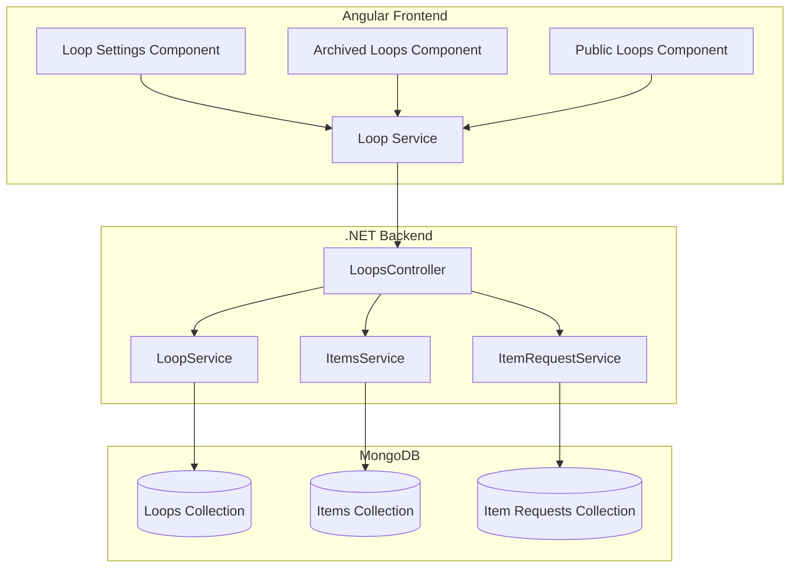
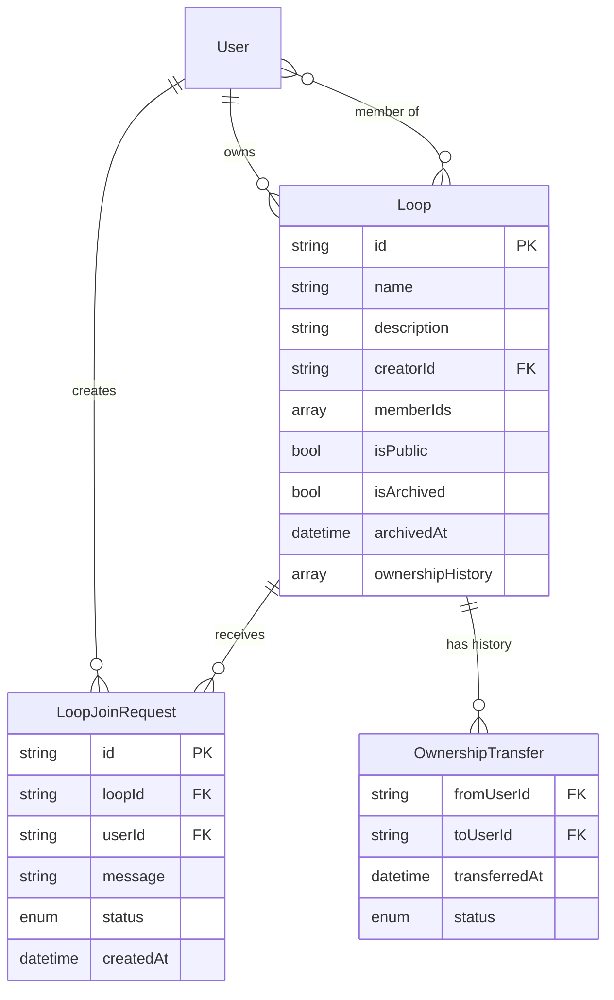

# Design Document: Loop Management

## Overview

The Loop Management feature extends the existing custom loops functionality to provide comprehensive administrative capabilities for loop owners and members. This design adds loop descriptions, privacy controls, ownership transfer, archival, and member management features.

This design builds upon the existing Loop model and services, adding new fields and methods while maintaining backward compatibility with the current implementation. The system continues to use MongoDB for data persistence and follows the established .NET 8 Web API and Angular architecture patterns.

## Architecture

### High-Level Architecture



### Technology Stack

- **Backend**: .NET 8 Web API, MongoDB.Driver
- **Frontend**: Angular 18+, RxJS
- **Database**: MongoDB
- **Authentication**: JWT (existing implementation)

## Components and Interfaces

### Backend Models

#### Updated Loop Model
```csharp
public class Loop
{
    [BsonId]
    [BsonRepresentation(BsonType.ObjectId)]
    public string? Id { get; set; }
    
    [BsonElement("name")]
    public string Name { get; set; } = string.Empty;
    
    [BsonElement("description")]
    public string Description { get; set; } = string.Empty;
    
    [BsonElement("creatorId")]
    public string CreatorId { get; set; } = string.Empty;
    
    [BsonElement("memberIds")]
    public List<string> MemberIds { get; set; } = new();
    
    [BsonElement("isPublic")]
    public bool IsPublic { get; set; } = false;
    
    [BsonElement("isArchived")]
    public bool IsArchived { get; set; } = false;
    
    [BsonElement("archivedAt")]
    public DateTime? ArchivedAt { get; set; }
    
    [BsonElement("ownershipHistory")]
    public List<OwnershipTransfer> OwnershipHistory { get; set; } = new();
    
    [BsonElement("createdAt")]
    public DateTime CreatedAt { get; set; } = DateTime.UtcNow;
    
    [BsonElement("updatedAt")]
    public DateTime UpdatedAt { get; set; } = DateTime.UtcNow;
}
```

#### OwnershipTransfer Model
```csharp
public class OwnershipTransfer
{
    [BsonElement("fromUserId")]
    public string FromUserId { get; set; } = string.Empty;
    
    [BsonElement("toUserId")]
    public string ToUserId { get; set; } = string.Empty;
    
    [BsonElement("transferredAt")]
    public DateTime TransferredAt { get; set; } = DateTime.UtcNow;
    
    [BsonElement("status")]
    public TransferStatus Status { get; set; } = TransferStatus.Pending;
}

public enum TransferStatus
{
    Pending,
    Accepted,
    Declined,
    Cancelled
}
```

#### LoopJoinRequest Model
```csharp
public class LoopJoinRequest
{
    [BsonId]
    [BsonRepresentation(BsonType.ObjectId)]
    public string? Id { get; set; }
    
    [BsonElement("loopId")]
    public string LoopId { get; set; } = string.Empty;
    
    [BsonElement("userId")]
    public string UserId { get; set; } = string.Empty;
    
    [BsonElement("message")]
    public string Message { get; set; } = string.Empty;
    
    [BsonElement("status")]
    public JoinRequestStatus Status { get; set; } = JoinRequestStatus.Pending;
    
    [BsonElement("createdAt")]
    public DateTime CreatedAt { get; set; } = DateTime.UtcNow;
    
    [BsonElement("respondedAt")]
    public DateTime? RespondedAt { get; set; }
}

public enum JoinRequestStatus
{
    Pending,
    Approved,
    Rejected
}
```

### Backend Services

#### Updated ILoopService Interface
```csharp
public interface ILoopService
{
    // Existing methods
    Task<Loop> CreateLoopAsync(string name, string creatorId);
    Task<Loop?> GetLoopByIdAsync(string loopId);
    Task<List<Loop>> GetUserLoopsAsync(string userId);
    Task<List<User>> GetLoopMembersAsync(string loopId);
    Task<bool> IsUserLoopMemberAsync(string loopId, string userId);
    Task<Loop?> AddMemberToLoopAsync(string loopId, string userId);
    Task<Loop?> RemoveMemberFromLoopAsync(string loopId, string userId);
    Task<List<User>> GetPotentialInviteesFromOtherLoopsAsync(string userId, string currentLoopId);
    
    // New methods for loop management
    Task<Loop?> UpdateLoopSettingsAsync(string loopId, string name, string description, bool isPublic);
    Task<Loop?> ArchiveLoopAsync(string loopId);
    Task<Loop?> RestoreLoopAsync(string loopId);
    Task<bool> DeleteLoopAsync(string loopId);
    Task<Loop?> InitiateOwnershipTransferAsync(string loopId, string fromUserId, string toUserId);
    Task<Loop?> AcceptOwnershipTransferAsync(string loopId, string userId);
    Task<Loop?> DeclineOwnershipTransferAsync(string loopId, string userId);
    Task<Loop?> CancelOwnershipTransferAsync(string loopId, string userId);
    Task<List<Loop>> GetArchivedLoopsAsync(string userId);
    Task<List<Loop>> GetPublicLoopsAsync(int skip = 0, int limit = 20);
    Task<List<Loop>> SearchPublicLoopsAsync(string searchTerm, int skip = 0, int limit = 20);
    Task<bool> IsLoopOwnerAsync(string loopId, string userId);
    Task<OwnershipTransfer?> GetPendingOwnershipTransferAsync(string loopId);
}
```

#### ILoopJoinRequestService Interface
```csharp
public interface ILoopJoinRequestService
{
    Task<LoopJoinRequest> CreateJoinRequestAsync(string loopId, string userId, string message);
    Task<LoopJoinRequest?> GetJoinRequestByIdAsync(string requestId);
    Task<List<LoopJoinRequest>> GetPendingJoinRequestsForLoopAsync(string loopId);
    Task<List<LoopJoinRequest>> GetUserJoinRequestsAsync(string userId);
    Task<LoopJoinRequest?> ApproveJoinRequestAsync(string requestId, string ownerId);
    Task<LoopJoinRequest?> RejectJoinRequestAsync(string requestId, string ownerId);
    Task<bool> HasPendingJoinRequestAsync(string loopId, string userId);
}
```

### Backend Controllers

#### Updated LoopsController Endpoints

**Loop Settings Management**
- `PUT /api/loops/{id}/settings` - Update loop settings (name, description, privacy)
- `GET /api/loops/{id}/settings` - Get loop settings

**Loop Archival**
- `POST /api/loops/{id}/archive` - Archive a loop
- `POST /api/loops/{id}/restore` - Restore an archived loop
- `GET /api/loops/archived` - Get user's archived loops
- `DELETE /api/loops/{id}` - Permanently delete a loop

**Ownership Transfer**
- `POST /api/loops/{id}/transfer-ownership` - Initiate ownership transfer
- `POST /api/loops/{id}/transfer-ownership/accept` - Accept ownership transfer
- `POST /api/loops/{id}/transfer-ownership/decline` - Decline ownership transfer
- `POST /api/loops/{id}/transfer-ownership/cancel` - Cancel ownership transfer
- `GET /api/loops/{id}/transfer-ownership/pending` - Get pending transfer

**Public Loops & Discovery**
- `GET /api/loops/public` - Get public loops (paginated)
- `GET /api/loops/public/search?q={term}` - Search public loops

**Join Requests**
- `POST /api/loops/{id}/join-requests` - Create join request for public loop
- `GET /api/loops/{id}/join-requests` - Get pending join requests (owner only)
- `POST /api/loops/join-requests/{requestId}/approve` - Approve join request
- `POST /api/loops/join-requests/{requestId}/reject` - Reject join request
- `GET /api/loops/join-requests/my-requests` - Get user's join requests

**Member Management**
- `DELETE /api/loops/{id}/members/{userId}` - Remove member from loop (owner only)
- `POST /api/loops/{id}/leave` - Leave a loop (non-owner members)

### Frontend Models

#### Updated TypeScript Interfaces
```typescript
export interface Loop {
  id?: string;
  name: string;
  description: string;
  creatorId: string;
  memberIds: string[];
  isPublic: boolean;
  isArchived: boolean;
  archivedAt?: Date;
  ownershipHistory: OwnershipTransfer[];
  createdAt: Date;
  updatedAt: Date;
  memberCount?: number;
  itemCount?: number;
}

export interface OwnershipTransfer {
  fromUserId: string;
  toUserId: string;
  transferredAt: Date;
  status: 'Pending' | 'Accepted' | 'Declined' | 'Cancelled';
  fromUserName?: string;
  toUserName?: string;
}

export interface LoopJoinRequest {
  id?: string;
  loopId: string;
  userId: string;
  message: string;
  status: 'Pending' | 'Approved' | 'Rejected';
  createdAt: Date;
  respondedAt?: Date;
  userName?: string;
  userEmail?: string;
}

export interface LoopSettings {
  name: string;
  description: string;
  isPublic: boolean;
}
```

### Frontend Services

#### Updated LoopService
```typescript
@Injectable({ providedIn: 'root' })
export class LoopService {
  private apiUrl = '/api/loops';
  
  // Existing methods...
  
  // Loop settings
  updateLoopSettings(loopId: string, settings: LoopSettings): Observable<Loop>;
  getLoopSettings(loopId: string): Observable<LoopSettings>;
  
  // Archival
  archiveLoop(loopId: string): Observable<Loop>;
  restoreLoop(loopId: string): Observable<Loop>;
  getArchivedLoops(): Observable<Loop[]>;
  deleteLoop(loopId: string): Observable<void>;
  
  // Ownership transfer
  initiateOwnershipTransfer(loopId: string, newOwnerId: string): Observable<Loop>;
  acceptOwnershipTransfer(loopId: string): Observable<Loop>;
  declineOwnershipTransfer(loopId: string): Observable<Loop>;
  cancelOwnershipTransfer(loopId: string): Observable<Loop>;
  getPendingOwnershipTransfer(loopId: string): Observable<OwnershipTransfer | null>;
  
  // Public loops
  getPublicLoops(skip?: number, limit?: number): Observable<Loop[]>;
  searchPublicLoops(searchTerm: string, skip?: number, limit?: number): Observable<Loop[]>;
  
  // Join requests
  createJoinRequest(loopId: string, message: string): Observable<LoopJoinRequest>;
  getLoopJoinRequests(loopId: string): Observable<LoopJoinRequest[]>;
  approveJoinRequest(requestId: string): Observable<LoopJoinRequest>;
  rejectJoinRequest(requestId: string): Observable<LoopJoinRequest>;
  getMyJoinRequests(): Observable<LoopJoinRequest[]>;
  
  // Member management
  removeMember(loopId: string, userId: string): Observable<void>;
  leaveLoop(loopId: string): Observable<void>;
  
  // Utility
  isLoopOwner(loopId: string): Observable<boolean>;
}
```

### Frontend Components

#### New Components

1. **LoopSettingsComponent** - Manage loop settings
   - Edit name, description, privacy
   - Archive/restore loop
   - Delete loop
   - Initiate ownership transfer
   - Remove members

2. **ArchivedLoopsComponent** - View and restore archived loops
   - List archived loops
   - Restore functionality
   - Permanent delete option

3. **PublicLoopsComponent** - Browse and search public loops
   - List public loops
   - Search functionality
   - Request to join

4. **LoopJoinRequestsComponent** - Manage join requests (owner view)
   - List pending requests
   - Approve/reject actions

5. **MyJoinRequestsComponent** - View user's join requests
   - List sent requests
   - Status tracking

6. **OwnershipTransferComponent** - Handle ownership transfer
   - Select new owner
   - Accept/decline transfer
   - View transfer status

7. **LoopMembersComponent** - View and manage members
   - List members
   - Remove member (owner only)
   - Leave loop (non-owner)

#### Updated Components

1. **LoopListComponent** - Add archived loops link
2. **LoopDetailComponent** - Add settings button for owners

#### Routing Structure
```
/loops/settings/:id - Loop settings page
/loops/archived - Archived loops list
/loops/public - Public loops discovery
/loops/:id/join-requests - Join requests management
/loops/my-join-requests - User's join requests
/loops/:id/members - Loop members management
/loops/:id/transfer-ownership - Ownership transfer
```

## Data Models

### MongoDB Collections

#### Updated loops Collection
- New fields: `description`, `isPublic`, `isArchived`, `archivedAt`, `ownershipHistory`
- New Indexes:
  - `isPublic` (ascending) - for public loop queries
  - `isArchived` (ascending) - for filtering archived loops
  - Compound: `isPublic + isArchived` - for public loop discovery
  - Text: `description` - for search functionality

#### New loopJoinRequests Collection
- Indexes:
  - `loopId` (ascending)
  - `userId` (ascending)
  - `status` (ascending)
  - Compound: `loopId + status` - for pending requests query
  - Compound: `userId + status` - for user's requests query

### Data Relationships



## Error Handling

### Backend Error Scenarios

1. **Settings Update Errors**
   - Non-owner attempting update → 403 Forbidden
   - Invalid description length → 400 Bad Request
   - Loop not found → 404 Not Found

2. **Archival Errors**
   - Non-owner attempting archive → 403 Forbidden
   - Already archived → 409 Conflict
   - Loop not found → 404 Not Found

3. **Deletion Errors**
   - Non-owner attempting delete → 403 Forbidden
   - Loop has active requests → 409 Conflict (optional: allow with cascade)
   - Database error → 500 Internal Server Error

4. **Ownership Transfer Errors**
   - Non-owner initiating transfer → 403 Forbidden
   - Target user not a member → 400 Bad Request
   - Pending transfer already exists → 409 Conflict
   - Invalid user accepting/declining → 403 Forbidden

5. **Join Request Errors**
   - Requesting to join private loop → 403 Forbidden
   - Already a member → 409 Conflict
   - Duplicate pending request → 409 Conflict
   - Non-owner approving/rejecting → 403 Forbidden

6. **Member Management Errors**
   - Owner attempting to leave → 400 Bad Request (must transfer ownership first)
   - Non-owner removing members → 403 Forbidden
   - Removing non-existent member → 404 Not Found

### Frontend Error Handling

1. **User-Friendly Messages**
   - Permission errors: "Only the loop owner can perform this action."
   - Validation errors: "Description must be 500 characters or less."
   - Conflict errors: "This loop is already archived."

2. **Confirmation Dialogs**
   - Archive loop: "Archive this loop? Members won't be able to view items."
   - Delete loop: "Permanently delete this loop? This cannot be undone."
   - Remove member: "Remove [name] from this loop?"
   - Leave loop: "Leave this loop? Your items will no longer be visible to members."

3. **Loading States**
   - Disable action buttons during operations
   - Show spinners for async operations
   - Provide feedback on completion

## Testing Strategy

### Backend Unit Tests

1. **LoopService Tests**
   - Update loop settings
   - Archive and restore loops
   - Delete loop with cascade cleanup
   - Ownership transfer workflow
   - Get archived loops
   - Get public loops
   - Member removal and leave loop

2. **LoopJoinRequestService Tests**
   - Create join request
   - Approve/reject requests
   - Prevent duplicate requests
   - Query pending requests

### Backend Integration Tests

1. **Loop Management Workflow**
   - Create loop → update settings → archive → restore
   - Create loop → transfer ownership → verify new owner
   - Create public loop → user requests to join → owner approves

2. **Cascade Operations**
   - Delete loop → verify items updated
   - Remove member → verify items updated
   - Archive loop → verify access restrictions

### Frontend Unit Tests

1. **Service Tests**
   - Mock HTTP calls for all new endpoints
   - Test error handling
   - Verify request/response mapping

2. **Component Tests**
   - Settings form validation
   - Confirmation dialog interactions
   - Member list display and actions
   - Public loop search

### Frontend Integration Tests

1. **User Flow Tests**
   - Owner updates loop settings
   - Owner transfers ownership
   - User discovers and joins public loop
   - Owner manages join requests
   - Member leaves loop

## Security Considerations

1. **Authorization**
   - Verify loop ownership for administrative actions
   - Verify loop membership for member actions
   - Validate ownership transfer participants

2. **Data Privacy**
   - Archived loops only visible to members
   - Public loops show limited information to non-members
   - Join requests only visible to loop owner

3. **Input Validation**
   - Sanitize loop descriptions
   - Validate description length (500 chars)
   - Prevent XSS in user-generated content

4. **Cascade Operations**
   - Ensure data consistency when deleting loops
   - Clean up orphaned join requests
   - Update item visibility when members removed

## Performance Considerations

1. **Database Optimization**
   - Index on isPublic and isArchived for filtering
   - Compound indexes for common queries
   - Pagination for public loop discovery

2. **Caching Strategy**
   - Cache loop settings on frontend
   - Invalidate cache on updates
   - Cache public loops list with TTL

3. **Query Optimization**
   - Use projection to limit fields in public loop queries
   - Batch member lookups
   - Limit join request queries to pending status

## Migration Strategy

### Database Migration

1. **Update loops Collection**
   - Add new fields with default values:
     - `description: ""`
     - `isPublic: false`
     - `isArchived: false`
     - `archivedAt: null`
     - `ownershipHistory: []`

2. **Create loopJoinRequests Collection**
   - Create collection with indexes

3. **Create Indexes**
   - Add new indexes to loops collection
   - Create indexes for loopJoinRequests collection

### Backward Compatibility

- Existing loops will default to private (isPublic: false)
- Existing loops will not be archived (isArchived: false)
- No breaking changes to existing endpoints
- New endpoints are additive

## Future Enhancements

1. **Advanced Privacy Controls**
   - Require approval for all members (even with invites)
   - Allow members to invite (not just owner)
   - Member roles (admin, moderator, member)

2. **Loop Templates**
   - Pre-configured loop settings
   - Category-based loops (tools, books, etc.)

3. **Loop Analytics**
   - Member activity tracking
   - Item sharing statistics
   - Popular items in loop

4. **Notifications**
   - Email notifications for ownership transfer
   - In-app notifications for join requests
   - Reminders for pending actions

5. **Bulk Operations**
   - Bulk member removal
   - Bulk item visibility updates
   - Export loop data
