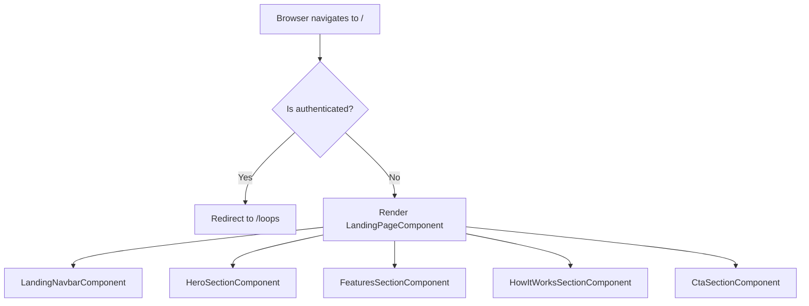

# Design Document: Public Landing Page

## Overview

The Public Landing Page is a marketing-focused Angular component served at the root route (`/`) of LendingLoop. It targets anonymous visitors and communicates the platform's value proposition, driving registrations through clear calls-to-action.

Currently, the root route (`/`) redirects all users to `/loops` via the `AuthGuard`, which then redirects unauthenticated users to `/login`. This design replaces that redirect with a dedicated `LandingPageComponent` that is publicly accessible. Authenticated users who navigate to `/` are redirected to `/loops` by the component itself (not the guard).

Key design decisions:
- The landing page is a **single standalone Angular component** with no dependency on authenticated state
- A new `PublicGuard` (or inline `canActivate` function) redirects authenticated users away from `/` to `/loops`
- The existing `AuthGuard` is not applied to the `/` route
- All content (features, steps) is **static data** defined in the component — no API calls required
- The page uses Angular Material and the existing app CSS design language for visual consistency

---

## Architecture



### Route Configuration Change

The existing root route:
```typescript
{ path: '', redirectTo: 'loops', pathMatch: 'full' }
```

Is replaced with:
```typescript
{
  path: '',
  component: LandingPageComponent,
  canActivate: [authenticatedRedirectGuard]
}
```

Where `authenticatedRedirectGuard` is a functional guard that redirects authenticated users to `/loops` and allows anonymous users through.

---

## Components and Interfaces

### LandingPageComponent

**Selector**: `app-landing-page`  
**File**: `ui/src/app/components/landing-page/landing-page.component.ts`

The root container component. Composes all section components. Has no logic beyond rendering child sections.

**Imports**: `CommonModule`, `RouterModule`, `LandingNavbarComponent`, `HeroSectionComponent`, `FeaturesSectionComponent`, `HowItWorksSectionComponent`, `CtaSectionComponent`

---

### LandingNavbarComponent

**Selector**: `app-landing-navbar`  
**File**: `ui/src/app/components/landing-page/landing-navbar/landing-navbar.component.ts`

Displays the top navigation bar. Conditionally shows login/register links for anonymous users, or a "Go to App" link for authenticated users.

**Inputs**: none  
**Dependencies**: `AuthService` (to check `isAuthenticated()`), `RouterModule`

**Template logic**:
- `*ngIf="!isAuthenticated"` → show Login link + Register CTA button
- `*ngIf="isAuthenticated"` → show "Go to App" link pointing to `/loops`

---

### HeroSectionComponent

**Selector**: `app-hero-section`  
**File**: `ui/src/app/components/landing-page/hero-section/hero-section.component.ts`

Displays the above-the-fold hero with headline, subheadline, and CTAs.

**Static content**:
- Headline: "Share More. Buy Less. Build Community."
- Subheadline: "LendingLoop lets you borrow and lend tools and items within trusted groups called loops."
- Primary CTA: "Get Started Free" → `/register`
- Secondary link: "Already have an account? Log in" → `/login`

---

### FeaturesSectionComponent

**Selector**: `app-features-section`  
**File**: `ui/src/app/components/landing-page/features-section/features-section.component.ts`

Renders a grid of feature highlight cards from a static `features` array.

**Data model**:
```typescript
interface FeatureHighlight {
  icon: string;       // Material icon name
  title: string;
  description: string;
}
```

**Static features array** (minimum 3):
1. "Trusted Loops" — Create or join sharing groups with people you trust
2. "Lend & Borrow Items" — Share tools and equipment with your community
3. "Owner-Controlled Approvals" — You decide who borrows your items, every time

---

### HowItWorksSectionComponent

**Selector**: `app-how-it-works-section`  
**File**: `ui/src/app/components/landing-page/how-it-works-section/how-it-works-section.component.ts`

Renders a numbered sequence of steps from a static `steps` array.

**Data model**:
```typescript
interface HowItWorksStep {
  stepNumber: number;
  title: string;
  description: string;
}
```

**Static steps array** (minimum 3):
1. "Create an Account" — Sign up with your email in under a minute
2. "Join or Create a Loop" — Connect with your community in a trusted sharing group
3. "Start Sharing" — List your items and request to borrow from others

---

### CtaSectionComponent

**Selector**: `app-cta-section`  
**File**: `ui/src/app/components/landing-page/cta-section/cta-section.component.ts`

A closing call-to-action section with a motivational message and register button.

**Static content**:
- Message: "Ready to start sharing with your community?"
- CTA button: "Join LendingLoop Today" → `/register`

---

### authenticatedRedirectGuard

**File**: `ui/src/app/guards/authenticated-redirect.guard.ts`

A functional `CanActivateFn` guard. If the user is authenticated, redirects to `/loops` and returns `false`. Otherwise returns `true`.

```typescript
export const authenticatedRedirectGuard: CanActivateFn = () => {
  const authService = inject(AuthService);
  const router = inject(Router);
  if (authService.isAuthenticated()) {
    router.navigate(['/loops']);
    return false;
  }
  return true;
};
```

---

## Data Models

All content on the landing page is static — no API calls are made. The data models are TypeScript interfaces used internally by the components.

```typescript
interface FeatureHighlight {
  icon: string;
  title: string;
  description: string;
}

interface HowItWorksStep {
  stepNumber: number;
  title: string;
  description: string;
}
```

These are defined in the component files directly (no shared model file needed given their narrow scope).

---

## Correctness Properties

*A property is a characteristic or behavior that should hold true across all valid executions of a system — essentially, a formal statement about what the system should do. Properties serve as the bridge between human-readable specifications and machine-verifiable correctness guarantees.*

### Property 1: Features section always renders at least three highlights

*For any* `features` array passed to or defined in `FeaturesSectionComponent`, the number of rendered feature highlight elements in the DOM should be greater than or equal to 3.

**Validates: Requirements 3.2**

---

### Property 2: Steps section always renders at least three steps

*For any* `steps` array passed to or defined in `HowItWorksSectionComponent`, the number of rendered step elements in the DOM should be greater than or equal to 3.

**Validates: Requirements 4.2**

---

### Property 3: Every step renders with a number, title, and description

*For any* step in the `steps` array, the rendered DOM for that step should contain a visible step number, a non-empty title, and a non-empty description.

**Validates: Requirements 4.3**

---

### Property 4: Nav bar shows authenticated home link when user is authenticated

*For any* authenticated user state, the `LandingNavbarComponent` should render a link to the authenticated home view (`/loops`) and should NOT render the login or register links.

**Validates: Requirements 6.5**

---

## Error Handling

The landing page makes no API calls, so there are no network error scenarios to handle. The only error-adjacent concern is:

- **Authenticated redirect failure**: If `AuthService.isAuthenticated()` throws unexpectedly, the guard should default to allowing access (fail open for public content). The guard's `try/catch` should fall through to `return true`.

---

## Testing Strategy

### Dual Testing Approach

Both unit tests and property-based tests are used. Unit tests cover specific examples and component rendering. Property-based tests verify universal properties across generated inputs.

### Unit Tests (Examples)

Each of the following is a specific example test in `landing-page.component.spec.ts` and related spec files:

- Hero section renders headline, subheadline, primary CTA (→ `/register`), and secondary login link (→ `/login`) — **Req 2.1–2.5**
- Features section renders and includes content for loops, lending, and owner approval — **Req 3.1, 3.3–3.5**
- How It Works section renders — **Req 4.1**
- CTA section renders with a register button and motivational message — **Req 5.1–5.3**
- Nav bar renders brand name, login link, and register CTA for unauthenticated users — **Req 6.1–6.4**
- Authenticated user navigating to `/` is redirected to `/loops` by `authenticatedRedirectGuard` — **Req 1.3**
- `authenticatedRedirectGuard` returns `true` for unauthenticated users — **Req 1.1, 1.2**

### Property-Based Tests

Use `fast-check` (already available in the Angular/Jest ecosystem) for property tests.

Each property test runs a minimum of **100 iterations**.

**File**: `ui/src/app/components/landing-page/landing-page.component.property.spec.ts`

- **Property 1** — Generate arrays of `FeatureHighlight` objects of varying lengths (>= 3). For each, render `FeaturesSectionComponent` and assert the rendered count equals the array length and is >= 3.
  - Tag: `Feature: public-landing-page, Property 1: features array renders >= 3 highlights`

- **Property 2** — Generate arrays of `HowItWorksStep` objects of varying lengths (>= 3). For each, render `HowItWorksSectionComponent` and assert the rendered count equals the array length and is >= 3.
  - Tag: `Feature: public-landing-page, Property 2: steps array renders >= 3 steps`

- **Property 3** — Generate arbitrary `HowItWorksStep` objects with random stepNumber, title, and description. For each, render the step and assert all three fields appear in the output.
  - Tag: `Feature: public-landing-page, Property 3: every step renders with number, title, and description`

- **Property 4** — For both `isAuthenticated = true` and `isAuthenticated = false` states, render `LandingNavbarComponent` and assert: when authenticated, home link is present and login/register links are absent; when not authenticated, login and register links are present.
  - Tag: `Feature: public-landing-page, Property 4: nav bar shows correct links based on auth state`

### Test Configuration

```typescript
// fast-check configuration
fc.configureGlobal({ numRuns: 100 });
```
