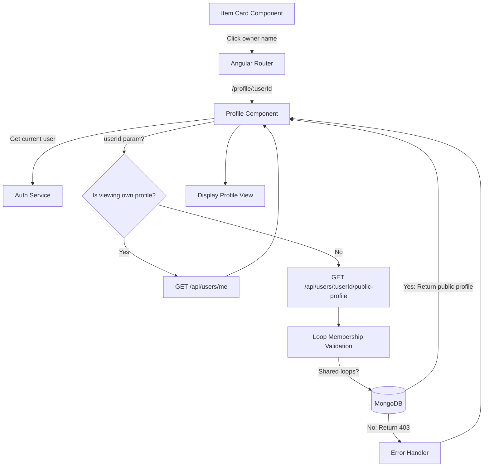

# Design Document: View Item Owner Profile

## Overview

This feature extends the existing profile functionality to support viewing other users' public profiles while maintaining privacy and security through loop membership validation. The design introduces a new backend API endpoint for public profile data, updates the Angular routing to support parameterized profile URLs, and implements loop membership verification to ensure users can only view profiles of people they share loops with.

The key architectural changes include:
- New backend endpoint: `GET /api/users/:userId/public-profile`
- Updated Angular route: `/profile/:userId` (with optional userId parameter)
- Loop membership validation service logic
- Conditional rendering in the profile component based on viewer/owner relationship

## Architecture

### System Components



### Data Flow

1. **User clicks owner name** → Item card navigates to `/profile/:userId`
2. **Profile component loads** → Extracts userId from route parameters
3. **Determine profile type**:
   - If no userId or userId matches current user → Fetch private profile from `/api/users/me`
   - If userId differs from current user → Fetch public profile from `/api/users/:userId/public-profile`
4. **Backend validates request**:
   - Verify user exists
   - Check loop membership (query loops collection for shared loops)
   - If validation passes → Return public profile data
   - If validation fails → Return 403 Forbidden
5. **Frontend renders profile** → Display appropriate fields based on profile type

## Components and Interfaces

### Backend Components

#### 1. Public Profile API Endpoint

**Route**: `GET /api/users/:userId/public-profile`

**Controller**: `UsersController.GetPublicProfile(string userId)`

**Authorization**: Requires authenticated user (JWT token)

**Response Model**:
```csharp
public class PublicProfileDto
{
    public string UserId { get; set; }
    public string FirstName { get; set; }
    public string LastName { get; set; }
    public int LoopScore { get; set; }
    public List<BadgeDto> Badges { get; set; }
    public List<ScoreHistoryEntryDto> ScoreHistory { get; set; }
}
```

**Error Responses**:
- `404 Not Found`: User does not exist
- `403 Forbidden`: Requesting user does not share any loops with target user
- `401 Unauthorized`: No valid authentication token

#### 2. Loop Membership Validation Service

**Service**: `ILoopsService.DoUsersShareLoopAsync(string userId1, string userId2)`

**Purpose**: Determine if two users are members of at least one common loop

**Implementation**:
```csharp
public async Task<bool> DoUsersShareLoopAsync(string userId1, string userId2)
{
    // Query loops collection for any loop where both users are members
    var sharedLoops = await _loopsCollection
        .Find(loop => 
            loop.Members.Any(m => m.UserId == userId1) && 
            loop.Members.Any(m => m.UserId == userId2))
        .FirstOrDefaultAsync();
    
    return sharedLoops != null;
}
```

**Returns**: `true` if users share at least one loop, `false` otherwise

#### 3. Users Service Extension

**Method**: `IUsersService.GetPublicProfileAsync(string requestingUserId, string targetUserId)`

**Logic**:
1. Validate target user exists
2. If requesting user equals target user, return full profile (or redirect to existing endpoint)
3. Validate loop membership using `DoUsersShareLoopAsync`
4. If validation passes, fetch and return public profile data
5. If validation fails, throw `UnauthorizedException`

**Data Retrieval**:
```csharp
public async Task<PublicProfileDto> GetPublicProfileAsync(string requestingUserId, string targetUserId)
{
    // Get target user
    var targetUser = await _usersCollection
        .Find(u => u.Id == targetUserId)
        .FirstOrDefaultAsync();
    
    if (targetUser == null)
        throw new NotFoundException("User not found");
    
    // Check if viewing own profile (should use different endpoint, but handle gracefully)
    if (requestingUserId == targetUserId)
        throw new BadRequestException("Use /api/users/me for your own profile");
    
    // Validate loop membership
    var shareLoop = await _loopsService.DoUsersShareLoopAsync(requestingUserId, targetUserId);
    if (!shareLoop)
        throw new UnauthorizedException("You can only view profiles of users in your loops");
    
    // Get loop score data
    var loopScore = await _loopScoreService.GetUserLoopScoreAsync(targetUserId);
    
    // Return public profile
    return new PublicProfileDto
    {
        UserId = targetUser.Id,
        FirstName = targetUser.FirstName,
        LastName = targetUser.LastName,
        LoopScore = loopScore.CurrentScore,
        Badges = loopScore.Badges,
        ScoreHistory = loopScore.ScoreHistory
    };
}
```

### Frontend Components

#### 1. Profile Component Updates

**Route Configuration**:
```typescript
{
  path: 'profile/:userId',
  component: ProfileComponent,
  canActivate: [AuthGuard]
}
```

**Component Logic**:
```typescript
export class ProfileComponent implements OnInit {
  userId: string | null = null;
  isOwnProfile: boolean = false;
  profileData: any = null;
  isLoading: boolean = true;
  errorMessage: string | null = null;

  constructor(
    private route: ActivatedRoute,
    private authService: AuthService,
    private usersService: UsersService,
    private router: Router,
    private location: Location
  ) {}

  ngOnInit(): void {
    // Get userId from route parameters
    this.route.paramMap.subscribe(params => {
      this.userId = params.get('userId');
      this.loadProfile();
    });
  }

  private loadProfile(): void {
    this.isLoading = true;
    this.errorMessage = null;
    
    const currentUser = this.authService.getCurrentUser();
    
    // Determine if viewing own profile
    if (!this.userId || this.userId === currentUser?.id) {
      this.isOwnProfile = true;
      this.loadPrivateProfile();
    } else {
      this.isOwnProfile = false;
      this.loadPublicProfile(this.userId);
    }
  }

  private loadPrivateProfile(): void {
    this.authService.refreshCurrentUser().subscribe({
      next: (user) => {
        this.profileData = user;
        this.isLoading = false;
      },
      error: (err) => {
        this.errorMessage = 'Failed to load profile';
        this.isLoading = false;
      }
    });
  }

  private loadPublicProfile(userId: string): void {
    this.usersService.getPublicProfile(userId).subscribe({
      next: (profile) => {
        this.profileData = profile;
        this.isLoading = false;
      },
      error: (err) => {
        if (err.status === 403) {
          this.errorMessage = 'You can only view profiles of users in your loops';
        } else if (err.status === 404) {
          this.errorMessage = 'User not found';
        } else {
          this.errorMessage = 'Failed to load profile';
        }
        this.isLoading = false;
      }
    });
  }

  goBack(): void {
    this.location.back();
  }
}
```

#### 2. Users Service Extension

**New Method**:
```typescript
export class UsersService {
  getPublicProfile(userId: string): Observable<PublicProfile> {
    return this.http.get<PublicProfile>(
      `${environment.apiUrl}/api/users/${userId}/public-profile`
    );
  }
}
```

**Interface**:
```typescript
export interface PublicProfile {
  userId: string;
  firstName: string;
  lastName: string;
  loopScore: number;
  badges: Badge[];
  scoreHistory: ScoreHistoryEntry[];
}
```

#### 3. Profile Template Updates

**Conditional Rendering**:
```html
<div class="profile-container" *ngIf="!isLoading">
  <!-- Header with back button -->
  <div class="profile-header">
    <button (click)="goBack()" class="back-button">
      <i class="fas fa-arrow-left"></i> Back
    </button>
    <h2>{{ isOwnProfile ? 'My Profile' : 'User Profile' }}</h2>
  </div>

  <!-- Error message -->
  <div *ngIf="errorMessage" class="error-message">
    {{ errorMessage }}
  </div>

  <!-- Profile content -->
  <div *ngIf="profileData && !errorMessage" class="profile-content">
    <!-- Name (always shown) -->
    <div class="profile-section">
      <h3>{{ profileData.firstName }} {{ profileData.lastName }}</h3>
    </div>

    <!-- Private information (only for own profile) -->
    <div *ngIf="isOwnProfile" class="profile-section">
      <p><strong>Email:</strong> {{ profileData.email }}</p>
      <p><strong>Address:</strong> {{ profileData.streetAddress }}</p>
    </div>

    <!-- Public information (always shown) -->
    <div class="profile-section">
      <h4>Loop Score: {{ profileData.loopScore }}</h4>
      
      <!-- Badges -->
      <app-badge-display [badges]="profileData.badges"></app-badge-display>
      
      <!-- Score History -->
      <div class="score-history">
        <h4>Score History</h4>
        <div *ngFor="let entry of profileData.scoreHistory" class="history-entry">
          <span class="date">{{ entry.date | date }}</span>
          <span class="change" [class.positive]="entry.change > 0" [class.negative]="entry.change < 0">
            {{ entry.change > 0 ? '+' : '' }}{{ entry.change }}
          </span>
          <span class="reason">{{ entry.reason }}</span>
        </div>
      </div>
    </div>
  </div>
</div>

<div *ngIf="isLoading" class="loading-spinner">
  Loading profile...
</div>
```

## Data Models

### Backend Models

#### PublicProfileDto
```csharp
public class PublicProfileDto
{
    public string UserId { get; set; }
    public string FirstName { get; set; }
    public string LastName { get; set; }
    public int LoopScore { get; set; }
    public List<BadgeDto> Badges { get; set; }
    public List<ScoreHistoryEntryDto> ScoreHistory { get; set; }
}
```

#### BadgeDto (existing)
```csharp
public class BadgeDto
{
    public string Name { get; set; }
    public string Description { get; set; }
    public string IconUrl { get; set; }
    public DateTime EarnedDate { get; set; }
}
```

#### ScoreHistoryEntryDto (existing)
```csharp
public class ScoreHistoryEntryDto
{
    public DateTime Date { get; set; }
    public int Change { get; set; }
    public string Reason { get; set; }
}
```

### Frontend Models

#### PublicProfile Interface
```typescript
export interface PublicProfile {
  userId: string;
  firstName: string;
  lastName: string;
  loopScore: number;
  badges: Badge[];
  scoreHistory: ScoreHistoryEntry[];
}
```

#### Badge Interface (existing)
```typescript
export interface Badge {
  name: string;
  description: string;
  iconUrl: string;
  earnedDate: Date;
}
```

#### ScoreHistoryEntry Interface (existing)
```typescript
export interface ScoreHistoryEntry {
  date: Date;
  change: number;
  reason: string;
}
```


## Correctness Properties

A property is a characteristic or behavior that should hold true across all valid executions of a system—essentially, a formal statement about what the system should do. Properties serve as the bridge between human-readable specifications and machine-verifiable correctness guarantees.

### Property 1: Loop Membership Validation

*For any* two distinct users (Profile_Viewer and Profile_Owner) who share at least one loop, when the Profile_Viewer requests the Profile_Owner's public profile, the API should return a successful response with profile data.

**Validates: Requirements 1.2, 4.5, 5.2**

### Property 2: No Shared Loops Returns Forbidden

*For any* two distinct users who do not share any loops, when one user requests the other's public profile, the API should return a 403 Forbidden error.

**Validates: Requirements 1.4, 3.6, 4.6, 5.3**

### Property 3: Public Profiles Exclude Private Fields

*For any* public profile response (when viewing another user's profile), the response should not contain email or streetAddress fields.

**Validates: Requirements 1.5, 1.6, 4.1, 4.2**

### Property 4: Non-Existent User Returns Not Found

*For any* non-existent userId, when a user requests that profile, the API should return a 404 Not Found error.

**Validates: Requirements 1.7, 3.5**

### Property 5: Public Profile Contains Required Fields

*For any* successful public profile response, the response should contain userId, firstName, lastName, loopScore, badges array, and scoreHistory array.

**Validates: Requirements 1.3, 6.1, 6.2, 6.3**

### Property 6: Private Profile Contains All Fields

*For any* user viewing their own profile, the response should contain all public fields plus email and streetAddress.

**Validates: Requirements 2.1, 4.3**

### Property 7: Self-Profile View Bypasses Loop Validation

*For any* user requesting their own profile (where requestingUserId equals targetUserId), the request should succeed regardless of loop membership.

**Validates: Requirements 5.4**

### Property 8: Score History Chronological Ordering

*For any* profile response containing score history, the score history entries should be ordered chronologically by date (earliest to latest or latest to earliest, consistently).

**Validates: Requirements 6.4**

## Error Handling

### Backend Error Scenarios

1. **User Not Found (404)**
   - Scenario: Requested userId does not exist in database
   - Response: `{ "error": "User not found" }`
   - HTTP Status: 404 Not Found

2. **No Shared Loops (403)**
   - Scenario: Requesting user and target user do not share any loops
   - Response: `{ "error": "You can only view profiles of users in your loops" }`
   - HTTP Status: 403 Forbidden

3. **Unauthenticated Request (401)**
   - Scenario: No valid JWT token provided
   - Response: `{ "error": "Unauthorized" }`
   - HTTP Status: 401 Unauthorized

4. **Invalid User ID Format (400)**
   - Scenario: userId parameter is malformed
   - Response: `{ "error": "Invalid user ID format" }`
   - HTTP Status: 400 Bad Request

### Frontend Error Handling

1. **Display User-Friendly Messages**
   - 403: "You can only view profiles of users in your loops"
   - 404: "User not found"
   - 401: Redirect to login
   - Other: "Failed to load profile. Please try again."

2. **Error State UI**
   - Show error message in place of profile content
   - Provide back button to return to previous page
   - Log errors to console for debugging

3. **Loading States**
   - Display loading spinner while fetching profile
   - Disable interactions during loading
   - Handle slow network conditions gracefully

## Testing Strategy

### Dual Testing Approach

This feature requires both unit tests and property-based tests to ensure comprehensive coverage:

- **Unit tests**: Verify specific examples, edge cases, and error conditions
- **Property tests**: Verify universal properties across all inputs

Both testing approaches are complementary and necessary for comprehensive coverage. Unit tests catch concrete bugs in specific scenarios, while property tests verify general correctness across many randomized inputs.

### Backend Testing (.NET)

#### Unit Tests

**UsersControllerTests.cs**:
- Test GET /api/users/:userId/public-profile with valid userId and shared loops returns 200
- Test GET /api/users/:userId/public-profile with non-existent userId returns 404
- Test GET /api/users/:userId/public-profile with no shared loops returns 403
- Test GET /api/users/:userId/public-profile with unauthenticated request returns 401
- Test GET /api/users/:userId/public-profile response does not include email or address

**UsersServiceTests.cs**:
- Test GetPublicProfileAsync with valid users and shared loops returns PublicProfileDto
- Test GetPublicProfileAsync with non-existent user throws NotFoundException
- Test GetPublicProfileAsync with no shared loops throws UnauthorizedException
- Test GetPublicProfileAsync response excludes email and streetAddress fields
- Test GetPublicProfileAsync includes loopScore, badges, and scoreHistory

**LoopsServiceTests.cs**:
- Test DoUsersShareLoopAsync returns true when users share one loop
- Test DoUsersShareLoopAsync returns true when users share multiple loops
- Test DoUsersShareLoopAsync returns false when users share no loops
- Test DoUsersShareLoopAsync with same userId (edge case)

#### Property-Based Tests

**PublicProfilePropertyTests.cs**:

Test configuration: Minimum 100 iterations per property test using FsCheck or similar library.

- **Property 1**: Loop membership validation
  - Tag: **Feature: view-item-owner-profile, Property 1: Loop membership validation**
  - Generate: Random pairs of users with at least one shared loop
  - Assert: API returns 200 with valid profile data

- **Property 2**: No shared loops returns forbidden
  - Tag: **Feature: view-item-owner-profile, Property 2: No shared loops returns forbidden**
  - Generate: Random pairs of users with zero shared loops
  - Assert: API returns 403 Forbidden

- **Property 3**: Public profiles exclude private fields
  - Tag: **Feature: view-item-owner-profile, Property 3: Public profiles exclude private fields**
  - Generate: Random valid public profile requests
  - Assert: Response does not contain email or streetAddress

- **Property 4**: Non-existent user returns not found
  - Tag: **Feature: view-item-owner-profile, Property 4: Non-existent user returns not found**
  - Generate: Random non-existent userIds
  - Assert: API returns 404 Not Found

- **Property 5**: Public profile contains required fields
  - Tag: **Feature: view-item-owner-profile, Property 5: Public profile contains required fields**
  - Generate: Random valid public profile requests
  - Assert: Response contains userId, firstName, lastName, loopScore, badges, scoreHistory

- **Property 6**: Private profile contains all fields
  - Tag: **Feature: view-item-owner-profile, Property 6: Private profile contains all fields**
  - Generate: Random users viewing their own profile
  - Assert: Response contains all public fields plus email and streetAddress

- **Property 7**: Self-profile view bypasses loop validation
  - Tag: **Feature: view-item-owner-profile, Property 7: Self-profile view bypasses loop validation**
  - Generate: Random users with varying loop memberships
  - Assert: User can always view their own profile successfully

- **Property 8**: Score history chronological ordering
  - Tag: **Feature: view-item-owner-profile, Property 8: Score history chronological ordering**
  - Generate: Random profiles with score history
  - Assert: Score history entries are ordered by date

### Frontend Testing (Angular with Jest)

#### Unit Tests

**profile.component.spec.ts**:
- Test component loads private profile when no userId parameter
- Test component loads private profile when userId matches current user
- Test component loads public profile when userId differs from current user
- Test component displays error message on 403 response
- Test component displays error message on 404 response
- Test component shows loading state while fetching
- Test goBack() calls location.back()
- Test isOwnProfile is true when viewing own profile
- Test isOwnProfile is false when viewing another user's profile

**users.service.spec.ts**:
- Test getPublicProfile() calls correct API endpoint with userId
- Test getPublicProfile() returns PublicProfile observable
- Test getPublicProfile() handles HTTP errors correctly

#### Property-Based Tests

**profile.component.property.spec.ts**:

Test configuration: Minimum 100 iterations per property test using fast-check library.

- **Property 3**: Public profiles exclude private fields (UI)
  - Tag: **Feature: view-item-owner-profile, Property 3: Public profiles exclude private fields**
  - Generate: Random public profile data
  - Assert: Template does not render email or address fields when isOwnProfile is false

- **Property 6**: Private profile contains all fields (UI)
  - Tag: **Feature: view-item-owner-profile, Property 6: Private profile contains all fields**
  - Generate: Random private profile data
  - Assert: Template renders email and address fields when isOwnProfile is true

### Integration Testing

- Test end-to-end flow: Click owner name → Navigate to profile → Display correct data
- Test navigation from item card to profile page
- Test back button returns to previous page
- Test profile page with various user scenarios (own profile, shared loops, no shared loops)

### Edge Cases to Test

- User with no badges (should display "No badges earned" message)
- User with empty score history
- User with very long name (UI truncation)
- Concurrent requests to same profile
- Profile request while user is being deleted
- Malformed userId parameters

